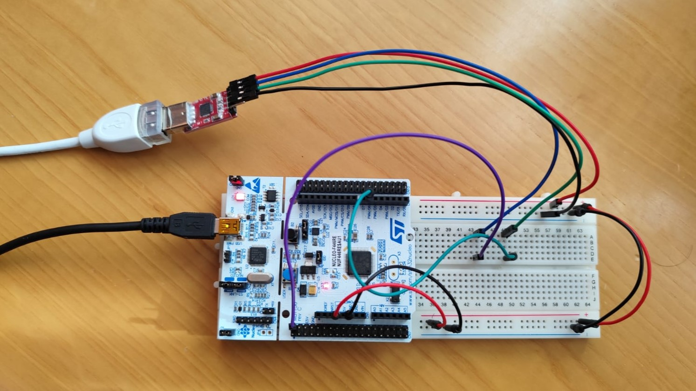
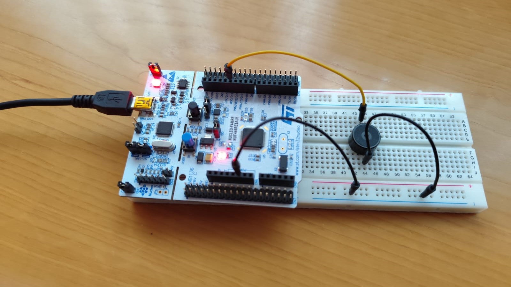
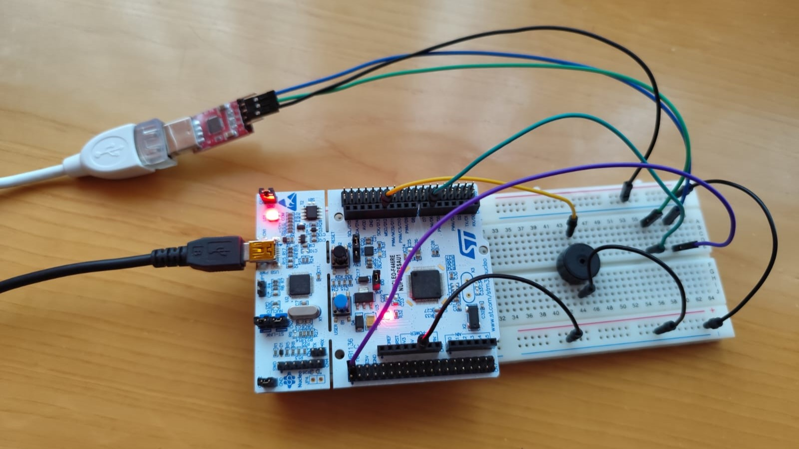

# Jukebox

## Authors

* **Rafael Horcas Mateo** - email: [r.horcasm@alumnos.upm.es](mailto:r.horcasm@alumnos.upm.es)
* **Víctor Mendizábal Gimeno** - email: [v.mendizabal@alumnos.upm.es](mailto:v.mendizabal@alumnos.upm.es)

En el proyecto Jukebox se establece una comunicación a través de un puerto USART usando STM32F446RE conectado a un ordenador. Esto permite la comunicación con un zumbador que puede reproducir melodías y cuenta con funcionalidades que se van desarrollando a lo largo del proyecto.

The Jukebox project establishes communication via USART port using an STM32F446RE connected to a computer. This enables communication with a buzzer capable of playing melodies. It has more functionalities that are developed throughout the project.

## Version 1
En la primera versión solo está habilitado el botón de usuario, el cual está conectado al **pin 13** de la **GPIO C**. 

El sistema es capaz de identificar si se pulsa el botón y durante cuanto tiempo. Debido al funcionamiento del hardware del botón es necesario implementar un sistema anti-rebotes, que ha sido configurado a **150ms**. De esta manera, solo se pueden identificar como pulsaciones válidas aquellas con este tiempo mínimo.

Para la detección de las pulsaciones se ha empleado la interrupción externa 13, **EXTI13**, que llama a la rutina de interrupción **EXTI15_10_IRQHandler**. Se desarrolla en el archivo de código fuente [interr.c](interr_8c.html).

En la siguiente tabla se especifican las diferentes configuraciones necesarias para el correcto funcionamiento del botón de usuario.

| Parámetro | Valor | 
| --------- | --------- | 
| Pin   | PC13   | 
| Mode   | Input   | 
| Pull up/down   | No push no pull   | 
| EXTI   | EXTI13   | 
| ISR   | EXTI15_10_IRQHandler  | 
| Priority  | 1  |
| Subpriority   | 0 | 
| Debounce time     | 150ms  | 

Para la implementación, en primer lugar, se ha desarrollado una librería basada en una máquina de estados finitos para el botón. Se puede observar el código en los siguientes ficheros:

Archivo de cabeceras: [fsm_button.h](fsm__button_8h.html)

Archivo de código fuente: [fsm_button.c](fsm__button_8c.html)

A continuación, se ha desarrollado el código necesario en la parte portable para la placa STM32F446RE. Además, es posible añadir más botones si se desea para versiones posteriores.

Archivo de cabeceras: [port_button.h](port__button_8h.html) 

Archivo de código fuente: [port_button.c](port__button_8c.html)

## Version 2
En la segunda versión se habilita la comunicación serie entre la placa y el ordenador mediante una USART. Esto servirá en un futuro para enviar diferentes comandos a la placa para diferentes funcionalidades.

Se va a usar la **USART3**. La transmisión, **TX**, se encuentra en la **GPIO B**, en el **pin 10** y la recepción, **RX**, se encuentra en la **GPIO C**, en el **pin 11**.
Para la comunicación se emplearan las propias interrupciones de la USART, RXNE y TXE. Estas llaman a la rutina de interrupción **USART3_IRQn**. Se desarrolla en el archivo de código fuente [interr.c](interr_8c.html).

Se realiza el siguiente montaje con ayuda de una protoboard. Por el momento puede parecer innecesaria pero en versiones posteriores tendrá más usos. 
El cable verde se corresponde con la conexión TX desde la placa. Por otro lado, el cable azul/morado se dedica a la conexión RX de la placa.

En la siguiente tabla se especifican las diferentes configuraciones necesarias para el correcto funcionamiento de la USART3.

| Parámetro | Valor | 
| --------- | --------- | 
| Baudrate   | 9600   | 
| Data bits   | 8   | 
| Stop bits  | 1   | 
| Parity   | None   | 
| Flow control   | None | 
| USART  | USART3 |
| Pins   | PB10 (TX) and PC11 (RX) | 
| Mode| Alternative |
| Pull up/down   | Pull up | 
| ISR   | USART3_IRQn | 
| Priority | 2  |
| Subpriority  | 0 | 

Para la implementación, en primer lugar, se ha desarrollado una librería basada en una máquina de estados finitos para la trasmisión y recepción de datos. Se puede observar el código en los siguientes ficheros:

Archivo de cabeceras: [fsm_usart.h](fsm__usart_8h.html) 

Archivo de código fuente: [fsm_usart.c](fsm__usart_8c.html)

A continuación, se ha desarrollado el código necesario en la parte portable para la placa STM32F446RE. Además, es posible añadir más USARTs si se desea para versiones posteriores.

Archivo de cabeceras: [port_usart.h](port__usart_8h.html) 

Archivo de código fuente: [port_usart.c](port__usart_8c.html)

## Version 3
En la tercera versión se reproducirán las melodías almacenadas en el archivo [melodies.c](melodies_8c.html), mediante el uso de un zumbador.

El zumbador está conectado al **pin 6** de la **GPIO A** y utiliza los temporizadores **TIM2** para controlar la duración de la nota y **TIM3** para establecer la frecuencia de la misma. 

Se realiza el siguiente montaje con ayuda de una protoboard para conectar el zumbador a la placa STM32F446RE. 

En la siguiente tabla se especifican las diferentes configuraciones necesarias para el correcto funcionamiento del **buzzer** y su **temporizador** para la frecuencia de las notas.

| Parámetro | Valor | 
| --------- | --------- | 
| PIN   | PA6   | 
| Mode| Alternative |
| Pull up/down   | Sin Pull | 
| Temporizador   | TIM3 |
| Modo PWM   | PWM 1 |
| Prescaler  | En funcion de la nota reproducida |
| Periodo  | En funcion de la nota reproducida |
| Ciclo de trabajo | 50 % |

En la siguiente tabla se muestran las especificaciones necesarias para configurar la duración de cada nota.

| Parámetro | Valor | 
| --------- | --------- | 
| Temporizador   | TIM2 |
| Prescaler  | En funcion de la nota reproducida |
| Periodo  | En funcion de la nota reproducida |
| ISR   | TIM2_IRQHANDLER() |
| Prioridad   | 3 |
| Subprioridad   | 0 |

La reproducción de cada nota musical se realiza con la repetición de de una señal digital **PWM** que toma los valores 0 y 1 periódicamente. Modificando la frecuencia de dicha señal mediante los registros **ARR** y **PSC** del temporizador, nuestro oido interpretará las distintas notas.
Se utilizará un ciclo de trabajo del 50%, para que el volumen de la nota musical sea el máximo.

Para la implementación, se ha desarrollado una librería basada en una máquina de estados finitos para el buzzer. Se puede observar el código en los siguientes ficheros:

Archivo de cabeceras: [fsm_buzzer.h](fsm__buzzer_8h.html) 

Archivo de código fuente: [fsm_buzzer.c](fsm__buzzer_8c.html)

A continuación, se ha desarrollado el código necesario en la parte portable para la placa STM32F446RE. Además, es posible añadir más BUZZERs si se desea para versiones posteriores.

Archivo de cabeceras: [port_buzzer.h](port__buzzer_8h.html) 

Archivo de código fuente: [port_buzzer.c](port__buzzer_8c.html)

## Version 4
En la cuarta versión se integrarán todos los componentes para que el sistema sea completamente funcional. 
Además se añadirán dos **modos de bajo consumo** para un uso más óptimo de los recursos.
Los modos **SLEEP_WHILE_ON** y **SLEEP_WHILE_OFF** activarán el modo bajo consumo si todas las FSM de los elementos están inactivas. 

En esta version se integran los distintos **comandos** para interactuar con la Jukebox.

| Comando | Parámetro | Funcionalidad | 
| --------- | --------- | --------- | 
| play  |-| Reproduce la melodía seleccionada |
| pause |-| Pausa la melodía seleccionada |
| stop  |-| Para la melodía |
| next  |-| Reproduce la próxima melodía|
| info  |-| Muestra la información de la melodía que se está reproduciendo|
| select|Número de la melodía| Selecciona la melodía en la posición correspondiente del array de melodías|
| speed|Velocidad| Cambia la velocidad de la melodía|

El montaje final se realiza con la ayuda de una protoboard que integra la USART junto con el zumbador a la placa STM32F446RE. 

A continuación se muestra una captura realizada con un osciloscopio del envío de un mensaje por el puerto serie hacia el ordenador. El canal dos (señal de color amarillo) se corresponde al envío del comando **info**. El canal uno (señal de color rojo) se corresponde a la señal respuesta, en este caso la melodía **scale**.

Para la implementación, se ha desarrollado una librería basada en una máquina de estados finitos para el sistema de maquinas de estados finitos JUKEBOX. Se puede observar el código en los siguientes ficheros:

Archivo de cabeceras: [fsm_jukebox.h](fsm__jukebox_8h.html) 

Archivo de código fuente: [fsm_jukebox.c](fsm__jukebox_8c.html)